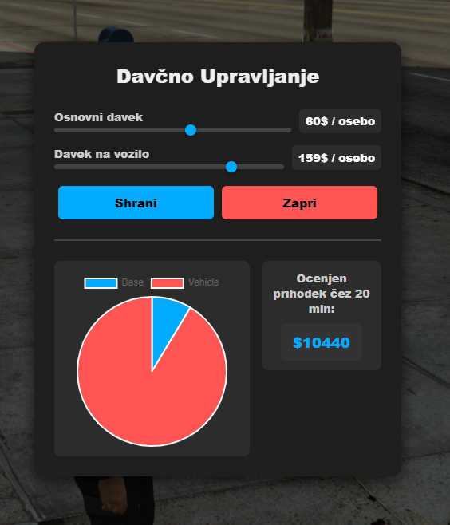

# UniBIT ESX Davčna Skripta (NUI + ox_lib)  -- SAMO ESX za vms_Cityhall supportom

Skripta periodično pobira davek od igralcev na strežniku in nakazuje sredstva v **Cityhall** (shranjeno kot `balance` v JSON stolpcu tabele `vms_business`). Skrbnik davkov (`clerk` z grade ≥ 5) lahko preko **custom HTML NUI menija** spreminja višino davkov.

---

## 🔧 Funkcionalnosti

- ✅ Periodični davek (osnovni + na vsako vozilo)
- ✅ Denar se prišteje v `vms_business.data.balance` (ID: `Cityhall`)
- ✅ Podpora za **ESX** in **oxmysql**
- ✅ Custom **NUI** meni za urejanje davkov
- ✅ **ox_lib notify** sistem za obveščanje igralcev
- ✅ Statistika o prihodkih v drzavno zakladnico na podlagi stare statistike igralcev
- ✅ Dinamična odzivnost NUI
- ✅ Sodoben UI.

---

## 📁 Struktura projekta

```
davki_resource/
├── fxmanifest.lua
├── config.lua
├── server.lua
├── client.lua
└── web/
    ├── index.html
    ├── style.css
    └── script.js
```


---

## Slika


